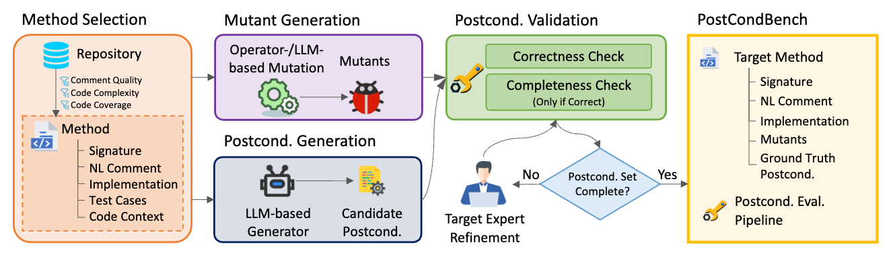
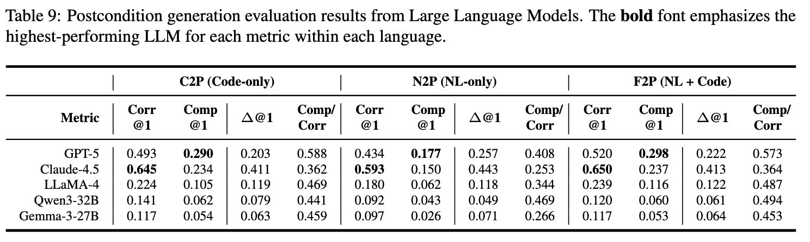

# POSTCONDBENCH: Benchmarking Correctness and Completeness in Formal Postcondition Inference



This repository includes code and a dataset proposed by the paper *POSTCONDBENCH: Benchmarking Correctness and Completeness in Formal Postcondition Inference*.

**Note:**
- Dataset path: `data/step/8.benchmark`. (420 Python/Java methods)
- Results path: `data/step/9.*`.
- Since our results are included in this repo, for anyone who would like to reuse, after environment and project setup, directly running `poetry run python src/script/data_analysis_latex_v2.py` can gather the experimental results.

## :whale: Environment Setup

The `./dockerfile` sets up the environment for our evaluation pipeline.

Run `docker build -f dockerfile -t postcondbench .` to build the Docker image and `docker run --rm -it -v "$PWD":/work -w /work postcondbench bash` to launch the container.

If you use [Slurm](https://slurm.schedmd.com/), you can transfer the Docker image into a `.sif` container file and launch the environment:

1. Run `docker save -o my-image.tar postcondbench` to save a `.tar` image file (in your docker image building environment).
2. Transfer `.tar` image file into `.sif` file by `apptainer build my-image.sif docker-archive://my-image.tar`.
3. To launch the environment, run `source apptainer.sh my-image.sif`.

## :open_file_folder: Project Setup

We use [poetry](https://python-poetry.org/) to manage the current repository. 
Just run `poetry install` to set it up.

## :wrench: Experiment Running

Within the environment, run experiment by:

```
# The task is divided into $task_num subtasks,
# and then the task labeled $task_idx is executed.
# Set task_num=1 and task_idx=0 by default.
task_num=1
task_idx=0
# This port value does not matter if you use a proprietary model. 
# For local LLMs, you should launch VLLM and fill this with your
# port that deploys the VLLM.
port=<YOUR_PORT>
# Three choices: 
#   1. v2-code (C2P in our paper)
#   2. v2-nl (N2P in our paper)
#   3. v2-all (F2P in our paper)
prompting=<v2-code|v2-nl|v2-all>

model_name=<gpt-5|claude-sonnet-4-5|llama-4-maverick|Qwen3-32B|gemma-3-27b>
generate_num=5

poetry run python src/job/postcond_generation_v2.py \
    --task_num $task_num \
    --task_idx $task_idx \
    --model_name $model_name \
    --port $port \
    --generate_num $generate_num \
    --prompting $prompting
```

## :floppy_disk: Results

Run `poetry run python src/script/data_analysis_latex_v2.py` after the experiment runs. It will read the experiment results in `data/step/9.*` and output LaTeX table source code for the experiment results.

```
>>> poetry run python src/script/data_analysis_latex_v2.py
...
GPT-5 & 0.493 & \textbf{0.290} & 0.203 & 0.588 & ...
...
Gemma-3-27B & 0.117 & 0.054 & 0.063 & 0.459 & ...
```

Results:



> ## AI Coding Assistance
> This repository includes AI-generated code. During development, we provide instructions to let ChatGPT (OpenAI) generate/refine code snippets. 
> We did *not* use generative AI tools to replace the authors' responsibility for the paper’s claims. All final text was reviewed and approved by the authors.
> All AI-suggested code was *reviewed, edited, and tested* by the authors before being merged.